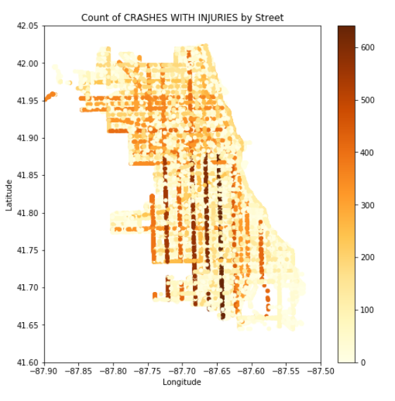
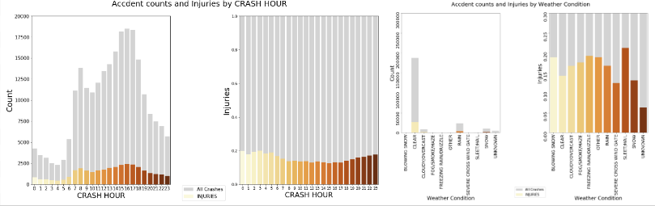
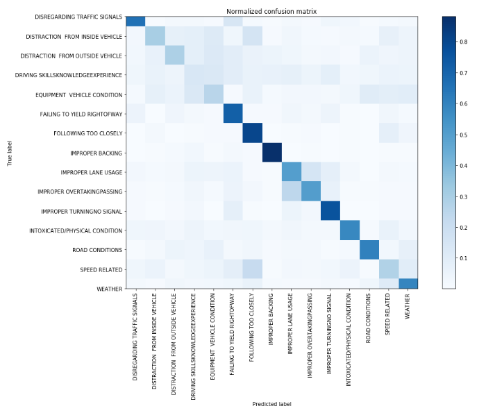
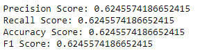
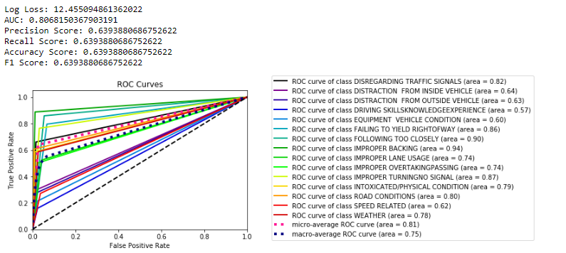

# Investigating the Car Accidents In Chicago

<a href="https://github.com/ariavathlete/chicago_primary_cause_of-caraccidents/blob/master/Analysis%20of%20Car%20Accidents%20In%20Chicago.pdf
">PRESENTATION</a>
<a href="https://github.com/ariavathlete/chicago_primary_cause_of-caraccidents/blob/master/Tesla_Full_Autonomy.pdf">| BLOG</a>

  

# Table Of Contents
* [Purpose](#purpose)
* [Data Files](#data-description)
* [Question 1](#question-1)
* [Question 2](#question-2)
* [Question 3](#question-3)
* [Future Work](#future-work)
  
<!---
# = h1
## = h2
### = h3
#### = h4
##### = h5
--->

# Purpose
The goal of this research is to analyze past housing data in order to predict sell prices of homes and answer the following questions: 
   * Q1 - What is the distribution of car accident causes?
   
   * Q2 - What regions do the most car accidents occur?
   
   * Q3 - What effect do external factors have on the amount of car crashes and car crashes with injuries?
      * The time of the days effect on car accidents.
      * The weather’s effect on car accidents.

# Data Description
Data files used:
   * veh.csv
   * crashes.csv
   * ppl.csv
   * dx.csv

## Question 1:
## What is the distribution of car accident causes?

### EDA
#### [Distribution of car accidents's primary causes](./visualizationsv.ipynb)
    

The most deadly types of crashes leading in proportions are Turning at 19% and Angle at 13%. I’ll recommend focusing on these as they account for the most fatalities.

### Conclusion
The most types of car accidents are Rear Ends accidents accounting for 30% of car crashes.
Followed by Sideswipe Same Direction accidents accounting for 16% of car crashes.

### Recommendation
The most deadly types of crashes leading in proportions are: Turning at 19% and Angle at 13%. I’ll recommend focusing on these by making better and seperate traffic signals for turning as they account for the most fatalities.

# Question 2:
## What regions do the most car accidents occur?

### EDA
#### [Distribution of car accidents with injuries by street](./visualizationsv.ipynb)
   

### Conclusion
From the geo-map showing the proportion of injuries caused by car accidents on each street by their longitude and latitude positions. As we can see from the map, more accidents with injuries occur about south-east from downtown of chicago, more especially on the major streets.

### Recommendation
I'll definitely recommend channeling more law enforcers and first aid responders towards the south central region of chicago in order to keep up with the high concentration of serious accidents that occur within these area.

# Question 3:
## What effect do external factors have on the amount of car crashes and car crashes with injuries?

### EDA
#### [Time & Weather's effect on amount of accidents that occur](./visualizationsv.ipynb)
   

### Conclusion
From the histogram we can see most accidents occur in clear weather but more accidents with injuries occurs when there’s hail or when it snows. We can also see more accidents occur from 4pm to 8pm.

### Recommendation
My recommendation based on this would be to employ more government trucks to salt the street when it snows to minimize the chances of having a fatal accident.

# [Modelling](./models/model1.ipynb)
Random Forest, X Boosting & LinearSVC classifiers where implimented after re-sampling with SMOTE since the dataset was heavily imbalanced and they all gave roughly the same results give or take 5%. So I opted to go with X Boosting classifier using PCA as its feature selection parameter. The features included where: 

   * Driver’s Action
   * Driver’s Vision
   * Roadway Surface Condition
   * Device Condition
   * First Crash Type 
   * Posted Speed Limit
   * Age
   * Physical Condition

  

## Interpretion
The model gave a log loss of 12.9 which and accuracy of 62%. This means the amount the model penelizes for incorrect predictions 12.6 but it only predicted 62% of the primary causes of accidents accurately.

  

Its total recall is 62% which is the total amount of times the model classified the cause of an accident was a category correctly out of the total amount of times that category was indeed the cause.

Its total precision is 62% and this is the total amount of times the model classified the cause of an accident was a category correctly out of the total amount of the predictions made for that category.

  

The AUC score is 0.8 and this is the average probability that the model can classifiy each class correctly. 

The main metrics we'll focus on for this would be recall and the AUC score as we won't want to incorrectly classify the cause of an accident and risk wrongfully blaming a driver for an accident when it might have been something else.

# Future Work
   * Road Type Division: Segregate the different types of streets/roads to understand the unique properties of accidents that occurs in each 

   * More Data: Gather more data like if a driver was on the phone, exceeded the posted speed limit or or has a good amount of driving experience
.
   
   * Region Division: Deeper analysis on the primary causes of accidents in the North, South, East West and Central regions of the city.
